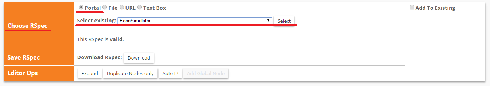

# Economic Simulator

## Instructions for installation on [GENI Testbed](http://www.geni.net/)
1. Create a slice and reserve resources using an existing RSpec
    Follow these instructions:
    http://groups.geni.net/geni/wiki/HowTo/LoadAnExistingRSpec
    
    In the Choose Rspec field, drop-down menu, select the following RSpec:
    
    

    The nodes login information should be the following:
    * users
        ```
       host info: ssh <username>@pc2.instageni.northwestern.edu -p <port>
        ip: 10.10.1.1
        ```

    * users-mkt
        ```
        host info: ssh <username>@pc2.instageni.northwestern.edu -p <port>
         ip: 10.10.1.2
            10.10.2.1
            10.10.6.2
       ```

    * users-providers
        ```
        host info: ssh <username>@pc2.instageni.northwestern.edu -p <port>
        ip: 10.10.2.2
            10.10.3.2
         ```

    * transit-mkt
       ```
        host info: ssh <username>@pc2.instageni.northwestern.edu -p <port>
        ip: 10.10.3.1
            10.10.4.2
            10.10.5.2
        ```

    * transit-providers
        ```
        host info: ssh <username>@pc2.instageni.northwestern.edu -p <port>
       ip: 10.10.4.1
        ```

     * database
        ```
        host info: ssh \<username\>@pc2.instageni.northwestern.edu -p <port>
        ip: 10.10.5.1
            10.10.6.1
        ```
. Install the codebase on the nodes
  * On the nodes "user-mkt, transit-mkt, and database":
        ```
        $ cd /home/
        $ git clone https://github.com/lmarent/network_agents_ver2.git
                $ wget http://pocoproject.org/releases/poco-1.7.5/poco-1.7.5-all.tar.gz        
        $ sudo apt-get -y install openssl libssl-dev
        $ sudo apt-get -y install libiodbc2 libiodbc2-dev
        $ sudo apt-get -y install mysql-client
       $ sudo apt-get install pkg-config
        
        $ make --version
        $ tar -xzvf poco-X.Y.tar
        $ cd poco-X.Y
        $ sudo apt-get -y install cmake        
        $ cmake -DENABLE_DATA_MYSQL=ON
        $ ./configure        $ make -s
        $ sudo make -s install
        $ export LD_LIBRARY_PATH="/usr/local/lib:$LD_LIBRARY_PATH"
        
        $ cd ../network_agents_ver2/foundation/
        $ libtoolize
        $ aclocal
        $ autoheader
        $ autoconf
        $ automake --add-missing
        $ ./configure
        $ make
        $ make install
        
        $ cd ../network_agents_ver2/CostFunctions/
        $ libtoolize
        $ aclocal
        $ autoheader
        $ autoconf
        $ automake --add-missing
        $ ./configure
        $ make
        $ sudo make install

        $ cd ../network_agents_ver2/MarketPlaceServer/
        $ libtoolize
        $ aclocal
        $ autoheader
        $ autoconf
        $ automake --add-missing
        $ ./configure
        $ make
        $ sudo make install

        $ cd ../network_agents_ver2/ClockServer/
        $ libtoolize
        $ aclocal
        $ autoheader
        $ autoconf
        $ automake --add-missing
        $ ./configure
        $ make
        $ sudo make install
        ```

    * On the nodes "users, transit-providers, user-providers, and database":
        ```
        $ cd /home/
        $ git clone https://github.com/lmarent/network_agents_ver2_python.git
        $ sudo apt-get install python-mysqldb  
        ```

    * On the "database" node:
        ```
        $ sudo apt-get -y install mysql-server
        $ sudo netstat -tap | grep mysqlb 
        
        $ sudo apt-get install python-mysqldb
        $ sudo apt-get install python-pip
        $ pip install django
        ```
        
    * On the "database" node: Setup the database
        ```
        usr=admin
        pwd=password
        CREATE DATABASE `Network_Simulation` /*!40100 DEFAULT CHARACTER SET latin1 */;
        ```
        
3. Running the code
    Run the following agents (in order):

    1. On the Database VM: 
        ```
        $ sudo /etc/init.d/mysql start
        $ cd /home/network_agents_ver2/ClockServer/src
        $ ./ClockServer
        ```
    
    2. On the Transit Marketplace VM:
        ```
        $ cd /home/network_agents_ver2/MarketPlaceServer/src
        $ ./MarketPlaceServer
        ```
    
    3. On the Users Marketplace VM:
        ```
        $ cd /home/network_agents_ver2/MarketPlaceServer/src
        $ ./MarketPlaceServer
        ```
    
    4. On the Transit Provider VM:
        ```
        $ cd /home/network_agents_ver2_python/agents
        $ python Provider.py
        ```    
    
    5. On the User Provider VM:
        ```
        $ cd /home/network_agents_ver2_python/agents
        $ python ProviderEdge.py
        ```
    
    6. On the User VM:
        ```
        $ cd /home/network_agents_ver2_python/agents
        $ python Consumers.py
        ```
